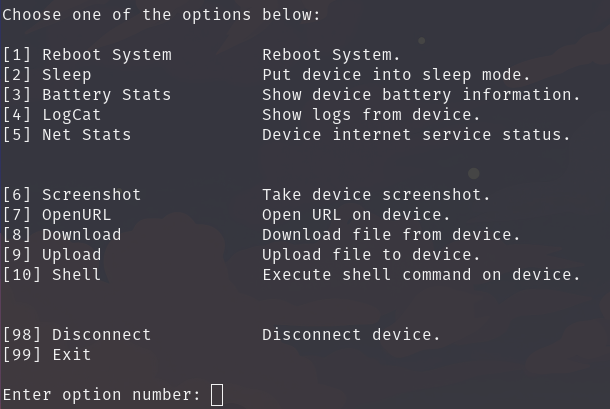

# DroidControl

O DroidControl é uma aplicação que permite controlar dispositivos Android por meio da porta TCP/IP 5555. Essa porta é comumente associada ao recurso ADB (Android Debug Bridge), que permite a comunicação entre um computador e um dispositivo Android para debug, instalação de aplicativos e outras tarefas de desenvolvimento.
  
O DroidControl oferece uma interface simples e intuitiva para interagir com dispositivos Android conectados à internet, seja em rede local ou externa. Ele permite que os usuários utilizem 10 opções funcionais para o dispositivo, como captura de tela, reiniciar dispositivo, abrir URL e muito mais, tudo por meio da conexão TCP/IP 5555.
  
O DroidControl oferece uma maneira conveniente e flexível de interagir com dispositivos Android sem a necessidade de cabos ou conexões físicas, além de melhorar a experiência do usuário ao fornecer controle remoto e gerenciamento eficazes.

## Funcionalidades

Principais funcionalidades do DroidControl.

- Reboot System: Reiniciar sistema.
- Sleep: Colocar o dispositivo no modo de suspensão.
- Battery Stats: Mostrar informações da bateria do dispositivo.
- LogCat: Mostrar registros do dispositivo.
- Net Stats: Status do serviço de internet do dispositivo.
- Screenshot: Fazer uma captura de tela do dispositivo.
- OpenURL: Abrir URL no dispositivo.
- Download: Baixar arquivo do dispositivo.
- Upload: Carregar arquivo para o dispositivo.
- Shell: Executar comandos shell no dispositivo.

## Instalação
- Caso utilize Windows, será necessário baixar manualmente o ADB e o Python.
- Execute o installer.sh somente em distribuições derivadas do Debian.
 
Comando para instalação e execução do arquivo: sudo bash installer.sh && python3 main.py

## Pré-requisitos
- Python 
- ADB 
 
Comando para instalar no Linux Fedora: sudo dnf install -y python3 android-tools
 
Comando para instalar no Arch Linux: sudo pacman -S --noconfirm python android-tools